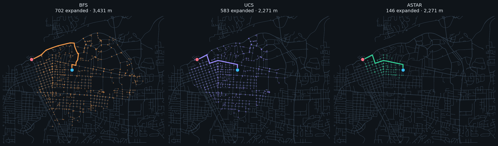
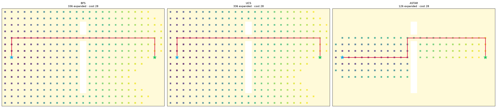
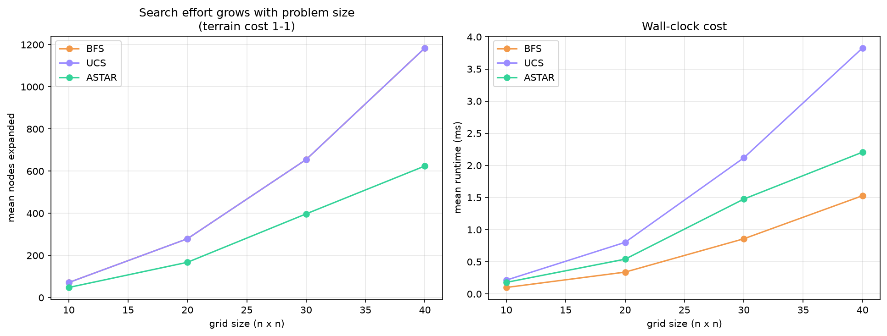

# Search Algorithms — from grid mazes to real streets

A graph search library with BFS, Uniform-Cost Search, A\*, and Contraction
Hierarchies (CH), implemented against one shared interface so the same
algorithm code runs on grid mazes, arbitrary graphs, and a real OpenStreetMap
street network.



*The same start and goal, three algorithms. BFS (left) and UCS (middle) flood
the neighbourhood; A\* (right) traces a narrow corridor to the goal — 146
intersections expanded instead of 583, for the exact same 2,271 m route.*

---

## Introduction

This started as a class assignment for CS 565 (graduate AI) implementing BFS,
UCS, and A\* on weighted grids. Assignments like that usually stop at the
grid: you compare node counts, write up why A\* wins, and move on.

I kept going because the interesting part — comparing how these algorithms
search — only really shows up when the graph is big and irregular, not a
20x20 grid. So I generalized the algorithms to run on any weighted graph,
pointed them at a real city's street network (Tuscaloosa, AL, via
OpenStreetMap), and then implemented Contraction Hierarchies, which is the
preprocessing technique real routing engines like OSRM and GraphHopper use to
answer routing queries fast.

What changed from the original assignment:

- **The grid assumption is gone.** Cost is a property of an edge, not a
  destination cell, so the same code runs on grids, plain graphs, and OSM
  data.
- **The search itself is recorded**, not just the final path, so you can look
  at which nodes each algorithm expanded and in what order.
- **The world can change mid-route.** A replanning module closes roads on a
  planned path and makes the agent discover the closure only on arrival.
- **The graph can be preprocessed.** Contraction Hierarchies trades a one-time
  setup cost for much faster queries afterward.

The base-algorithm results below are pinned as regression tests, so the
numbers in this README are asserted by the test suite, not just claimed.

---

## Contraction Hierarchies

Plain Dijkstra and A\* redo their full search on every query. That's fine for
a one-off route, but it's the wrong approach if you're answering many queries
against a graph that doesn't change often — which is exactly the situation a
routing service is in. Contraction Hierarchies fixes this: preprocess the
graph once, then each query only searches a small fraction of it.

Measured on the real Tuscaloosa street network, after **1.1 s** of
preprocessing:

| | Nodes expanded | Query time |
|---|---:|---:|
| Dijkstra | 2,378 | 3.364 ms |
| Contraction Hierarchies | **87** | **0.259 ms** |

That's **13x faster queries, 27x fewer nodes expanded**. The results are not
approximate — all 200 randomly sampled query pairs returned exactly
Dijkstra's optimal cost, which is checked in
[`tests/test_ch_osm.py`](tests/test_ch_osm.py).

```bash
python examples/build_graph.py                              # one-time: cache the city
python -m search_algorithms.ch.cli query --graph osm        # compare on one route
python -m search_algorithms.ch.cli preprocess --graph osm   # watch contraction run
python -m search_algorithms.benchmark.run_ch_benchmark      # the full experiments
```

Full explanation of how it works, the results, and its limitations:
[`docs/contraction_hierarchies.md`](docs/contraction_hierarchies.md).

---

## Install

```bash
git clone <your-repo-url>
cd Search-Algorithms

python -m venv .venv
.venv\Scripts\activate         # Windows
# source .venv/bin/activate    # macOS / Linux

pip install -e ".[all]"
```

The core library needs only `networkx`. The extras are opt-in:
`osm` (OSMnx routing), `viz` (matplotlib figures), `dev` (pytest).

---

## Quick start

### On a grid

```python
from search_algorithms import GridProblem, astar

problem = GridProblem.from_file("maps/map1.txt")
result = astar(problem)

print(result.cost)            # 11
print(result.nodes_expanded)  # 19
print(result.path)            # [(0, 0), (0, 1), ...]
```

```bash
python examples/grid_demo.py --map maps/map3.txt --algorithm all --show-path
```

### On real streets

```python
from search_algorithms import astar
from search_algorithms.problems.osm_problem import OSMProblem, load_place_graph

graph = load_place_graph("Tuscaloosa, Alabama, USA")   # cached after first call

start = OSMProblem.nearest_node(graph, 33.2083, -87.5504)  # Bryant-Denny Stadium
goal  = OSMProblem.nearest_node(graph, 33.2122, -87.5692)  # Tuscaloosa Amphitheater

result = astar(OSMProblem(graph, start=start, goal=goal))
print(f"{result.cost:,.0f} m over {result.steps} intersections")
print(f"expanded {result.nodes_expanded} nodes")
```

### On any graph at all

```python
from search_algorithms import GraphProblem, ucs

problem = GraphProblem.from_undirected(
    [("A", "B", 4.0), ("A", "D", 2.0), ("D", "E", 1.0), ("E", "F", 7.0)],
    start="A",
    goal="F",
)
print(ucs(problem).path)   # ['A', 'D', 'E', 'F']
```

---

## Algorithms

| Algorithm | Priority | Optimal? | Notes |
|---|---|---|---|
| `bfs` | fewest edges | only when all costs are equal | Ignores cost. Finds the fewest intersections, often not the shortest distance. |
| `ucs` | `g(n)` | yes | Expands the cheapest known node first. Correct, but searches outward in every direction. |
| `astar` | `g(n) + h(n)` | yes, with an admissible `h` | Same answer as UCS, far less work, because the heuristic points it toward the goal. |
| `weighted_astar` | `g(n) + w·h(n)` | within a factor of `w` | Trades guaranteed optimality for speed. |
| `greedy_best_first` | `h(n)` | no | Fast and direct, but can commit to a bad path. |

---

## Results

### Weighted grids

Every number below is asserted as a regression test
([`tests/test_algorithms.py`](tests/test_algorithms.py)):

| Map | | BFS | UCS | A\* |
|---|---|---:|---:|---:|
| map1 | cost / expanded | 11 / 25 | 11 / 25 | 11 / **19** |
| map2 | cost / expanded | 57 / 15 | 12 / 13 | 12 / **12** |
| map3 | cost / expanded | 28 / 336 | 28 / 336 | 28 / **126** |



### Real streets

Bryant-Denny Stadium → Tuscaloosa Amphitheater, over 4,630 intersections:

| Algorithm | Distance | Intersections | Nodes expanded |
|---|---:|---:|---:|
| BFS | 3,431 m | 19 | 702 |
| UCS | 2,271 m | 24 | 583 |
| A\* | **2,271 m** | 24 | **146** |

A\* finds the same optimal route as UCS while expanding about a quarter of
the nodes.

### Heuristic quality

A\*'s advantage depends on how *informative* the heuristic is, not just
whether it's admissible (never overestimates):

| Grid terrain | A\* vs UCS (nodes expanded) |
|---|---|
| uniform cost (all 1) | **1.76x fewer** |
| weighted 1–9 | 1.02x fewer |

Manhattan distance assumes every step costs at least 1. On a grid where a step
can cost up to 9, that assumption underestimates the true remaining cost by a
lot — the heuristic is still admissible, so A\* is still optimal, but it's so
uninformative that A\* barely outperforms UCS. On the street network the
heuristic (great-circle distance) is measured in the same units as the edge
costs, which is why it works well there.

```bash
python -m search_algorithms.benchmark.run_benchmark --trials 20 --max-weight 1
python -m search_algorithms.benchmark.run_benchmark --trials 20 --max-weight 9
```



### Follow-up questions

**1. Why can BFS return a more expensive path than UCS on a weighted grid?**

BFS orders its frontier by depth, not cost, and returns the first path
that reaches the goal. That path has the fewest edges, but fewest edges
only means cheapest when every edge costs the same. The weighted grid
(`maps/map2.txt`) shows the gap at its widest: 8 steps costing 57, versus
12 steps costing 12. The same thing happens on the street network for the
same reason: BFS uses 19 intersections but drives 1.2 km further than
necessary.

**2. If UCS and A\* return the same cost, why does A\* expand fewer states?**

Both are best-first searches that differ only in how they order the
frontier. UCS uses `g(n)`, the cost already spent getting there, so it
expands outward in every direction equally, including away from the goal.
A\* uses `f(n) = g(n) + h(n)`, adding an estimate of the remaining cost,
which lowers the priority of states that are cheap to reach but point the
wrong way. With an admissible `h`, A\* never expands a state whose `f`
exceeds the optimal cost, so it never expands more states than UCS, and
usually expands far fewer. In the route figures, UCS's expanded region is
roughly circular; A\*'s is stretched toward the goal.

**3. What happens to A\* when h(n) = 0 everywhere?**

`f(n) = g(n) + 0 = g(n)`, which is exactly UCS's priority function. A\*
becomes UCS, including identical tie-breaking and an identical expansion
order. This is checked in
[`tests/test_problem_abc.py::test_zero_heuristic_makes_astar_equal_ucs`](tests/test_problem_abc.py),
which compares the full `expansion_order` lists, not just the counts. The
zero heuristic is technically admissible, since it never overestimates —
it just never estimates anything, which is why it does not save any work.

**4. If Manhattan distance h(n) is replaced by 2·h(n), is A\* still optimal?**

Not always. Doubling the estimate can push it above the true remaining
cost, which makes the heuristic inadmissible. When that happens, A\* can
settle on a suboptimal path — it may return the goal while a cheaper route
is still sitting in the frontier, because that cheaper route looked worse
due to the inflated estimate.

There is still a bound, though. Weighted A\* with `f = g + w·h` returns a
path that costs at most `w` times the optimal cost. So `2h` gives a result
that is at most 2x the optimal cost, and in practice it is usually much
closer than that while expanding far fewer nodes. This is implemented as
`weighted_astar`, and the bound is checked in
[`tests/test_algorithms.py::test_weighted_astar_is_bounded_suboptimal`](tests/test_algorithms.py).

One detail worth noting: on the weighted grids used in this project,
Manhattan distance underestimates the true cost by so much that doubling
it (`2h`) usually still stays admissible in practice. Whether doubling the
heuristic actually breaks optimality depends on how much slack the
original heuristic had.

---

## Replanning

A planned route assumes the world doesn't change. `examples/replanning_demo.py`
closes roads along a planned path and has the agent discover each closure only
when it arrives there, replanning from wherever it currently is:

```
Replans needed:        3
Distance driven:       4,109 m
Best possible:         2,533 m
Cost of not knowing:   1,576 m  (+62.2%)

Total nodes expanded:  387   (first plan + every replan)
Omniscient planner:    193
Extra search work:     2.01x
```

Not knowing about the closures in advance costs distance driven and extra
search work, both of which are measured here.

---

## Structure

```
src/search_algorithms/
  core/
    problem.py       Problem interface — neighbors, edge_cost, heuristic
    algorithms.py    bfs, ucs, astar, weighted_astar, greedy_best_first
    heuristics.py    manhattan, euclidean, chebyshev, haversine
    result.py        SearchResult — path, cost, nodes_expanded, expansion_order
  problems/
    grid_problem.py  the original weighted grid
    graph_problem.py any adjacency map
    osm_problem.py   an OpenStreetMap street network
  ch/
    graph.py         CHGraph (being contracted) + PreparedCH (queryable)
    ordering.py      node importance: which node to contract next
    preprocess.py    the contraction loop and its witness search
    query.py         bidirectional rank-restricted search + unpacking
    build.py         adapters from Problem/OSMProblem/adjacency maps
    cli.py           verbose preprocess/query from the terminal
  replanning/        repeated A* against a changing world
  viz/               matplotlib figures for grids and maps
  benchmark/         randomized trials, synthetic graphs, comparison plots
```

The design decision everything else follows from is in
[`core/problem.py`](src/search_algorithms/core/problem.py): cost is a
property of an **edge** (`edge_cost(a, b)`), not of a destination cell. A
simple grid can get away with `step_cost(state)`, because entering a square
costs the same no matter which direction you came from. A one-way street
can't be described that way. Making cost a function of the edge is what let
the same search code move from grid mazes to real maps.

The algorithms also record `expansion_order` and `parent_of` alongside the
answer. Those were always computed internally and previously thrown away;
keeping them is what makes the node-expansion comparisons above possible.

Contraction Hierarchies sits next to that interface instead of using it
directly. Every other algorithm here asks a `Problem` for neighbours on
demand. CH rewrites the graph up front (adding shortcut edges) and then only
walks edges that climb its hierarchy — that doesn't fit behind `neighbors()`,
so it's implemented separately. It still returns the same `SearchResult`
type, so its output stays directly comparable to the other algorithms.

---

## Tests

```bash
pytest                 # 232 tests
```

Covers: baseline grid-search results, path validity and optimality,
admissibility of every heuristic, directed edges and one-way streets,
unreachable goals, expansion traces, replanning behavior, and — for
Contraction Hierarchies — exact cost-equivalence against Dijkstra across grid
maps, random graphs, tie-heavy lattices, and 200 pairs on the real street
network, plus the structural invariants the query correctness depends on.

Tests that need the cached street graph skip automatically if you haven't
downloaded it, so the suite still runs offline.

---

## Future work

- **D\* Lite** — the replanner here restarts its search from scratch on every
  replan. D\* Lite reuses the previous search tree instead, which would cut
  that ~2x search overhead substantially.
- **Customizable Contraction Hierarchies** — separate the edge costs from the
  graph topology, so costs can change without re-contracting the whole graph.
- **Time-dependent costs** — make `edge_cost` a function of time, so rush hour
  traffic can change the routing.
- **Jump Point Search** for uniform-cost grids.

---

## Credits

Map data © [OpenStreetMap](https://www.openstreetmap.org/copyright) contributors,
retrieved with [OSMnx](https://osmnx.readthedocs.io/).

MIT licensed — see [LICENSE](LICENSE).
