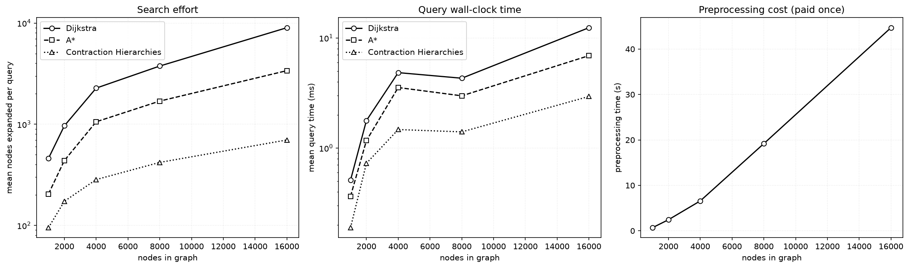
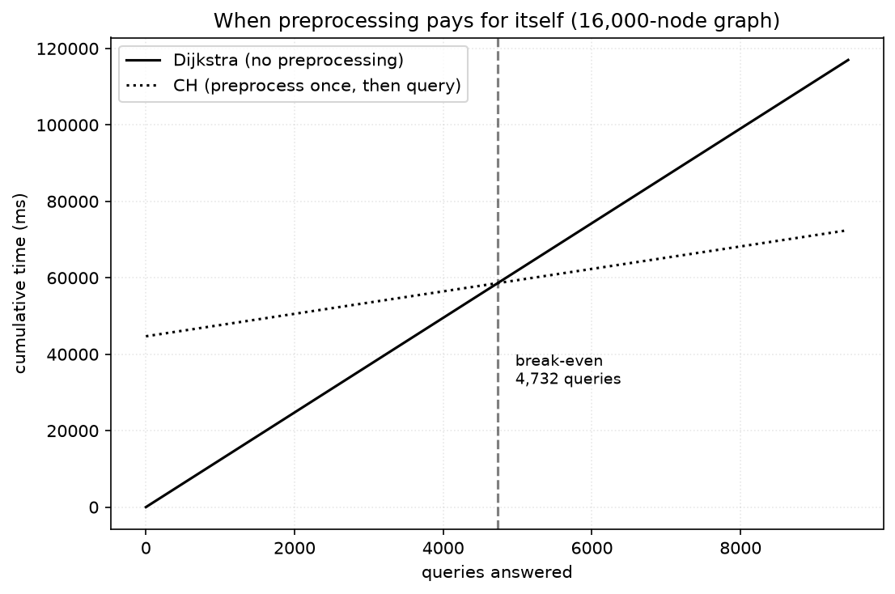

# Contraction Hierarchies

Dijkstra and A\* do a full search on every query. That is wasteful if the
graph does not change often and you run many queries against it, which is
the normal case for a routing service. Contraction Hierarchies (CH) fixes
this by preprocessing the graph once, building an index, then answering
each query by searching only a small part of the graph. This is the
technique production routers such as OSRM and GraphHopper use.

CH is not an approximation. It returns the exact same distance Dijkstra
would return. It just does not need to look at most of the graph to find it.

Every number below was produced by code in this repository:

```bash
python examples/build_graph.py                          # one-time: cache the city
python -m search_algorithms.benchmark.run_ch_benchmark \
    --json docs/ch_results.json --plot-dir docs/images
```

Measured on CPython 3.13.1, Windows 11, Intel 12th-gen (x86-64), single
core, 2026-09-21. Raw output is committed at
[`ch_results.json`](ch_results.json), so every number here can be checked
against that file.

---

## How it works

### Preprocessing

Nodes are removed from the graph one at a time, cheapest-to-remove first.
Removing a node `v` can break a shortest path that went through it. So for
every pair of `v`'s neighbours `(u, w)`, the algorithm checks:

> Is `u → v → w` the only shortest way from `u` to `w` once `v` is removed?

It checks this with a **witness search**: a bounded Dijkstra run from `u`
that is not allowed to use `v`. If that search finds a path to `w` that
costs no more than `cost(u,v) + cost(v,w)`, that path is a witness — the
distance still exists without `v`, so nothing needs to be added. If no such
path is found, a **shortcut edge** `u → w` is added with that combined cost.
The shortcut also records what it stands for — `(u, w) → (via=v, cost)` —
so it can later be expanded back into the original edges.

Each node gets a **rank** when it is contracted, in order. Low rank means
contracted early (usually a dead end or minor connector). High rank means
contracted late (usually a real junction that many routes pass through).

### Query

A query runs two Dijkstra searches at the same time: one forward from the
start, one backward from the goal. Both searches only follow edges that go
to a higher rank. The forward search only relaxes `u → v` when
`rank[v] > rank[u]`. The backward search applies the same rule to incoming
edges.

This restriction is not a heuristic guess, it is guaranteed to work. During
preprocessing, whenever contracting a node would have broken a shortest
path, a shortcut was added to preserve that distance at a higher rank. As a
result, for any two nodes `s` and `t`, the augmented graph always contains
a shortest path that goes up to one highest-ranked node and then down —
this is called bitonic. Because of that, searching upward from both ends is
enough to find it: the two searches meet at that highest-ranked node, and
the meeting point splits the path into the two halves each search found.

The path is then rebuilt by expanding any shortcuts back into the original
edges they replaced.

### Example

On [`maps/map3.txt`](../maps/map3.txt) (15×25 grid, 365 reachable cells):

```
$ python -m search_algorithms.ch.cli preprocess --graph grid --map maps/map3.txt

  nodes                   365
  original edges          1,356
  shortcuts added         3,124
  edge growth             2.30x original edges
  witness searches        5,973
  witness hits            4,473
  wall time               0.31s
```

4,473 of 5,973 witness searches (75%) found a witness and did not need to
add a shortcut. That is the ordering heuristic working correctly — it is
contracting nodes whose removal costs the graph almost nothing.

---

## Correctness

It is easy to implement CH in a way that looks correct but is not. If the
witness search accepts one witness too many, a necessary shortcut gets
dropped silently. The result is a query that runs fast and returns a path
that is slightly too long. Nothing crashes, so this kind of bug is easy to
miss. Because of that, the tests in
[`tests/test_ch.py`](../tests/test_ch.py) and
[`tests/test_ch_osm.py`](../tests/test_ch_osm.py) check the following:

1. **Exact cost match.** CH's cost must equal Dijkstra's cost, checked over
   every pair of nodes on small graphs, and over 200 random pairs on the
   real street network.
2. **Path validity.** Every unpacked path is checked with
   `Problem.validate_path`, the same check used for every other algorithm
   in this repo, and its edge costs must sum to the reported cost. This
   confirms that unpacking a shortcut produces a real path, not just a
   number that happens to be correct.
3. **Structural checks.** Ranks must be a permutation of `0..n-1`, and
   following upward edges must always increase rank, so the query search
   cannot loop.
4. **Contraction preserves distances.** Shortest paths in the graph after
   contraction must match the original graph, checked separately from the
   query so a failure points at contraction rather than the search.

### A bug this caught

An earlier version of the witness search accepted a witness that cost
exactly the same as the shortcut, not just less. That seems fine on its
face — an equally short path should be a valid substitute. It passed a fuzz
test of hundreds of thousands of random-weight queries, because random
float weights almost never tie exactly.

It was still wrong. An equal-cost witness is only a valid substitute if it
still exists later. Here is the failure case: contracting node `v` finds an
equal-cost witness through node `x`, so the shortcut is skipped. Later, `x`
itself gets contracted, and its witness search finds an equal-cost route
back through where `v` used to be, so that shortcut gets skipped too. Now
both shortcuts are missing, and the distance they were supposed to carry is
gone.

Grid maps have many equal-cost paths, so this showed up immediately:
`map3.txt` returned a cost of 30 instead of the correct 28. The fix is to
require the witness to be strictly cheaper, not equal. This is now a
permanent regression test, `test_tie_heavy_graphs_match_dijkstra`, which
uses small integer weights and grid layouts specifically because those
produce ties often.

---

## Results

### Experiment A — query cost vs. graph size

Synthetic road-like graphs (a jittered grid layout with a few long
arterial connections — see
[`synthetic_graph.py`](../src/search_algorithms/benchmark/synthetic_graph.py)).
60 query pairs per graph size. Every algorithm answers the same pairs on
the same graph, in the same process, one after another.

| Nodes | Dijkstra expanded | A\* expanded | CH expanded | Dijkstra ms | A\* ms | CH ms | Speedup | Node reduction |
|---:|---:|---:|---:|---:|---:|---:|---:|---:|
| 1,000 | 460 | 205 | **95** | 0.510 | 0.364 | **0.189** | 2.7x | 4.8x |
| 2,000 | 966 | 438 | **173** | 1.774 | 1.167 | **0.726** | 2.4x | 5.6x |
| 4,000 | 2,275 | 1,057 | **284** | 4.838 | 3.542 | **1.471** | 3.3x | 8.0x |
| 8,000 | 3,759 | 1,693 | **420** | 4.303 | 2.977 | **1.401** | 3.1x | 9.0x |
| 16,000 | 8,997 | 3,386 | **699** | 12.383 | 6.900 | **2.938** | 4.2x | 12.9x |



The important pattern here is that the node-reduction ratio grows as the
graph gets bigger: 4.8x at 1,000 nodes, 12.9x at 16,000 nodes. That is the
main claim CH makes — the advantage is not a fixed multiplier, it increases
with graph size.

Wall-clock speedup (2.4x–4.2x) is lower than the node-reduction ratio. The
reason: CH visits far fewer nodes, but each node it does visit has more
edges to check, because contraction roughly doubles the average number of
edges per node. Splitting the graph into separate upward and downward edge
lists ahead of time fixed most of this (it doubled the measured speedup
when it was added), but not all of it.

### Experiment B — preprocessing cost

| Nodes | Original edges | Shortcuts added | Edge growth | Preprocessing time |
|---:|---:|---:|---:|---:|
| 1,000 | 3,818 | 6,226 | 1.63x | 0.69 s |
| 2,000 | 7,704 | 14,113 | 1.83x | 2.44 s |
| 4,000 | 15,530 | 29,577 | 1.90x | 6.57 s |
| 8,000 | 31,196 | 64,119 | 2.06x | 19.18 s |
| 16,000 | 62,588 | 134,336 | 2.15x | 44.70 s |

Preprocessing time grows faster than the graph size in this implementation
— roughly 2.5x per doubling — and the resulting graph is about twice the
size of the original. Both of these costs are real and are not hidden in
the speedup numbers above.

### Experiment C — break-even point

Preprocessing is a one-time cost. Queries are cheap after that but happen
repeatedly. The break-even point is the number of queries at which the
total time spent (preprocessing plus queries) for CH becomes less than the
total time spent running plain Dijkstra for the same number of queries:



On the 16,000-node synthetic graph, that point is about 4,700 queries. On
the real street network it is about 357 queries, because CH's per-query
advantage is much larger there while preprocessing is much cheaper.

This number is what actually determines whether CH is worth using. If you
only need to route a handful of trips on a graph you will not query again,
plain Dijkstra is faster overall. If you are running a service that answers
many queries against a fixed map, CH wins. A speedup number without this
trade-off stated is incomplete.

### Experiment D — real street network

Tuscaloosa's drivable network: 4,630 intersections, 11,234 road segments,
200 random query pairs.

| | Nodes expanded | Query time |
|---|---:|---:|
| Dijkstra | 2,378 | 2.335 ms (sd 1.289) |
| Contraction Hierarchies | **87** | **0.175 ms** (sd 0.072) |

13.3x faster, 27.3x fewer nodes expanded. All 200 queries returned exactly
Dijkstra's cost. Preprocessing took 0.77 s and added 11,221 shortcuts.

The real network performs better than any of the synthetic graphs above,
and this is expected, not a coincidence. Real road networks have a small
number of levels between local streets and major roads — residential
streets feed into arterials, arterials feed into highways — and this is
exactly the structure contraction relies on. The synthetic graphs only
approximate that structure. Tuscaloosa has it for real.

This is also why the honest number to report for this project is 13x, not
the 100x–1000x figures sometimes quoted for continental-scale routers.
Those numbers come from graphs with tens of millions of nodes, where the
hierarchy has many more levels. Experiment A shows the trend pointing that
direction, but this implementation does not reach that scale — see
Limitations below.

### Experiment E — ordering ablation

The same 1,000-node graph, contracted three different ways. All three
produce correct results (the test suite checks this), so any difference
here is about efficiency, not correctness.

| Ordering | Shortcuts | Nodes expanded | Query ms | Preprocessing |
|---|---:|---:|---:|---:|
| **Edge difference** (default) | **6,226** | **85** | **0.136** | **0.65 s** |
| Degree (static) | 25,535 | 311 | 1.007 | 3.66 s |
| Random | 20,434 | 141 | 0.574 | 5.91 s |

The default ordering produces 4x fewer shortcuts and 3.7x fewer node
expansions than ordering by degree. This shows that CH's speed does not
come from having shortcuts in general — it comes from choosing the right
nodes to contract first. A bad ordering adds too many shortcuts, the graph
ends up denser than the original, and most of the benefit is lost.

---

## Limitations

This is a simplified version of CH. The simplifications below are
deliberate choices, not oversights, but they should be stated plainly.

- **The node ordering is only partly lazy.** A full production
  implementation re-checks the priority of every neighbor of a node right
  after that node is contracted. This implementation instead marks
  neighbors as possibly-stale and only re-checks a node's priority when it
  is popped from the queue. This is cheaper but less accurate. The stat
  `priority_reevaluations` reports how often a re-check changed the
  result.
- **The witness search is bounded.** It stops after 5 hops or 500 visited
  nodes by default. If it hits either limit without finding a witness, it
  assumes no witness exists and adds a shortcut that may not have been
  strictly necessary. This does not cause incorrect results — it only adds
  a shortcut that costs a bit of extra space and query time. The tests
  confirm correctness holds at several different bound values.
- **A small set of top-level nodes is left uncontracted** (0.5% by
  default). Contracting the last few nodes gets very expensive, because
  they end up almost fully connected to each other. In testing, the last
  1% of nodes took over half of total preprocessing time. Leaving them
  uncontracted and letting the query search between them without the rank
  restriction keeps results correct while avoiding that cost.
- **Preprocessing runs on a single core, in pure Python, and its runtime
  grows faster than linearly with graph size.** Production
  implementations contract independent nodes in parallel and use
  memory layouts designed for CPU cache performance. This is why the
  experiments here stop at 16,000 nodes instead of the 500,000 originally
  planned. The scaling trend is shown clearly across a 16x range of sizes,
  but the size ceiling here is a limitation of this implementation, not of
  the algorithm itself.
- **Timed queries do not unpack shortcuts into full paths.** The benchmark
  calls the query function with `unpack=False`, since it is measuring
  search cost, not path reconstruction. The reported cost is identical
  either way, which the tests confirm.

---

## Where the code lives

| Module | What it does |
|---|---|
| [`ch/graph.py`](../src/search_algorithms/ch/graph.py) | `CHGraph` (being contracted) and `PreparedCH` (ready for queries, with edges pre-split by direction) |
| [`ch/ordering.py`](../src/search_algorithms/ch/ordering.py) | Decides which node to contract next, plus the two baseline orderings used in Experiment E |
| [`ch/preprocess.py`](../src/search_algorithms/ch/preprocess.py) | The contraction loop and the witness search |
| [`ch/query.py`](../src/search_algorithms/ch/query.py) | The bidirectional search and shortcut unpacking |
| [`ch/build.py`](../src/search_algorithms/ch/build.py) | Converts a `Problem`, `OSMProblem`, or adjacency map into a `CHGraph` |
| [`ch/cli.py`](../src/search_algorithms/ch/cli.py) | Run with `python -m search_algorithms.ch.cli` |

CH is implemented as a separate module rather than as another
implementation of `Problem`. Every other algorithm in this library asks a
`Problem` for neighbors as it searches. CH does not work that way: it
rewrites the graph before any query runs, then only walks edges that go
upward in rank. That does not fit the `neighbors()` interface, so it is
implemented on its own. It still returns the same `SearchResult` type as
every other algorithm, so its output can be compared directly.
